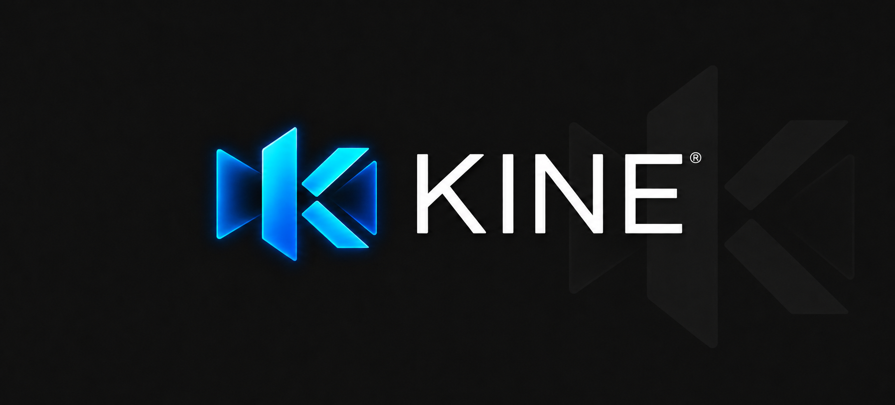
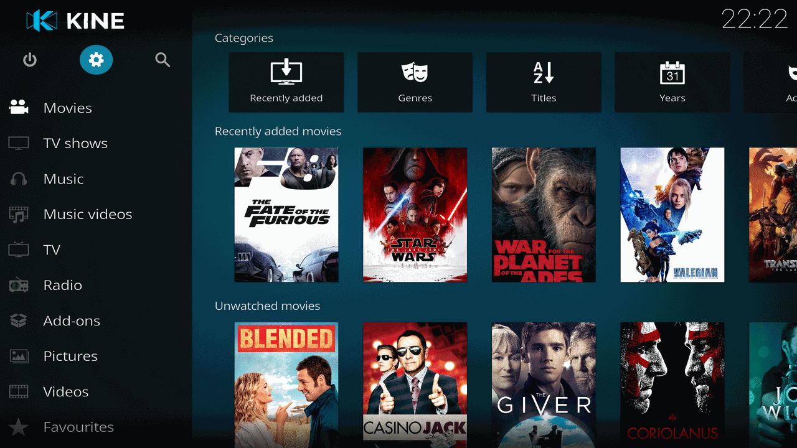

  <strong>
    <a href="https://kodi.tv/">website</a>
    •
    <a href="https://kodi.wiki/view/Main_Page">docs</a>
    •
    <a href="https://forum.kodi.tv/">community</a>
    •
    <a href="https://kodi.tv/addons">add-ons</a>
  </strong>

  
  
  
  
  
  

<h1 align="center">
  Welcome to Kine Home Theater Software!
</h1>

Kine is a Quest-optimized fork of Kodi, the award-winning free and open-source media player and entertainment hub. It adds controller-friendly navigation, seamless HDR10, Dolby Vision and Dolby Atmos playback, plus a built-in VR player for 3D movies, including MVC, SBS and TAB videos in ISO, MKV and MP4 containers.

With its **beautiful interface and powerful skinning engine**, Kine is the ideal solution for your Quest "home theater".

## Give your media the love it deserves
Kine can be used to play almost all popular audio and video formats around. It was designed for network playback, so you can stream your multimedia from anywhere in the house or directly from the internet using practically any protocol available.

Point Kine to your media and watch it **scan and automagically create a personalized library** complete with box covers, descriptions, and fanart. There are playlist and slideshow functions, a weather forecast feature and many audio visualizations. Once installed, your Quest will become a fully functional multimedia jukebox.

  

## Acknowledgements
Kine couldn't exist without

* All the **[Kodi contributors](https://github.com/xbmc/xbmc/graphs/contributors)**. Big or small a change, it does make a difference.
* All the developers that write the fantastic **software and libraries** that Kodi and Kine use. We stand on the shoulders of giants.
* Kodi's **[fantastic community](https://forum.kodi.tv/)**.

## License
Kine is **[GPLv2 licensed](LICENSE.md)**. You may use, distribute and copy it under the license terms.

